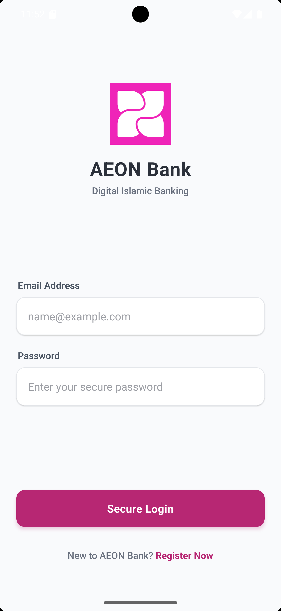
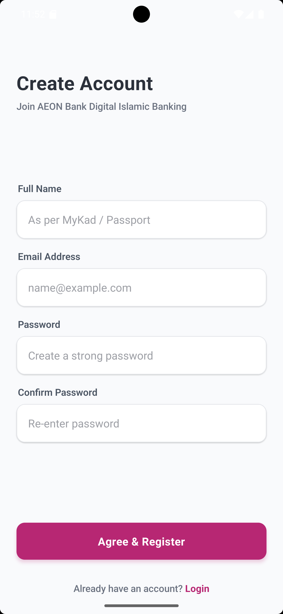
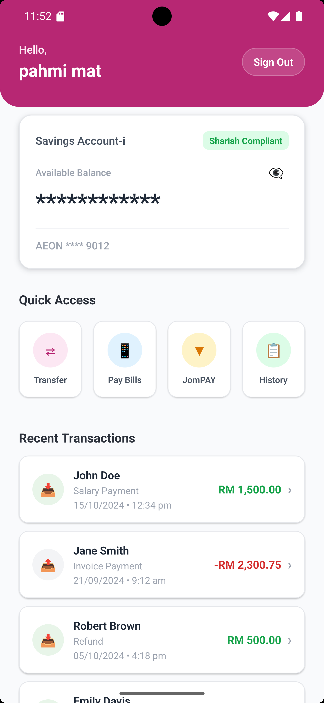
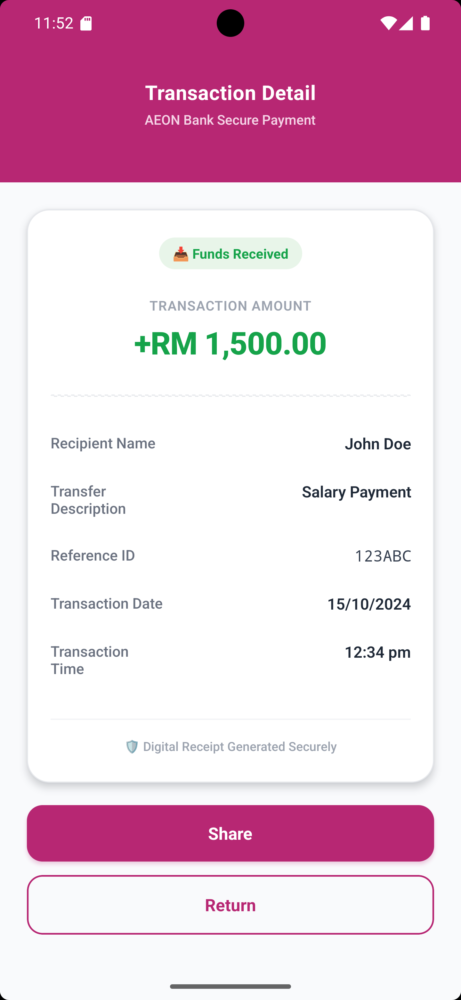

# Collabera Assessment

A clean, modern React Native mobile dashboard and secure transaction receipt sharing module built with utility state management, dynamic data models, and native UI capturing features.

---

## 🚀 Quick Start Guide

Follow these steps sequentially to clone, configure, and boot the application environment on your local development device.

### Prerequisites

Before starting, ensure your machine has the following global environments configured:
* **Node.js** >= 18
* **Java Development Kit (JDK)** == 17 *(Required for modern Gradle compatibility)*
* **Android Studio** (with an active Virtual Device - minSdkVersion 24/targetSdkVersion 36) and/or **Xcode** (macOS only)

## Step 1: Clone the project in to your local

First, make sure you have setup your github in your desktop.

Then proceed to run this command to clone the repository.

```sh
git clone https://github.com/Fahmimat92/CollaberaAeon.git
```

## Step 2: Basic step to run

Before we started to run this project, start with installing the dependencies first by using this command :

```sh
npm install
```

## Step 3: Build and run your app

First, you will need to run Metro, the JavaScript build tool for React Native.

To start the Metro dev server, run the following command from the root of your React Native project:

```sh
npm run start
```

Once Metro is up and running, open another terminal and run this command to run your apps on android physical device/simulator device.
```sh
npm run android
```

Optional : You can manually open your android simulator device from your AVD Manager before running the apps. Kindly check the simulator status by running this command.
```sh
adb devices
```

If everything is set up correctly, you should see your new app running in the Android Emulator, or your connected device.

This is one way to run your app — you can also build it directly from Android Studio or Xcode.

## Congratulations! :tada:

You've successfully run CollaberaAeon App. :partying_face:

## 📱 App Preview

| Login Screen | Register Screen | Home Screen | Detail Screen |
|---|---|---|---|
|  |  |  |  |

> **Note**: This is a simple banking application called Aeon Bank Apps.

There are 4 main screen and feature in this apps which is :
- Login screen : This screen will authenticate user to login into our home screen. User login will be persist until user opt to logout.
- Signup screen : This screen is to register and signup new user for using the apps.
- Home screen : This is the landing screen once the user signup and able to login and view list of transaction.
- Detail screen : User able to view the full transaction detail and have the option to share it externally.
